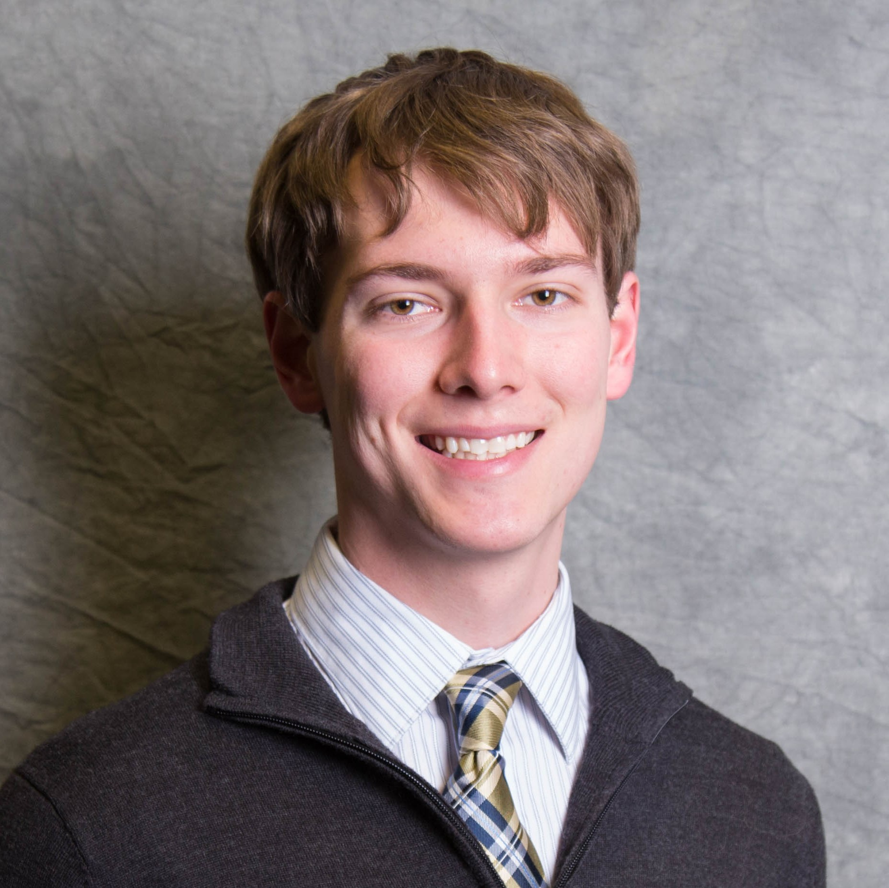

# &nbsp; Justin Yirka  

[Interests](#research-interests) / [Education](#education) / [Experience](#research-experience) / [Publications](#journal-publications) / [Presentations](#conference-presentations) / [News](#news)

Quantum Computing Researcher and Student  
Future Ph.D. student at the University of Texas at Austin (beginning Fall 2019)

##### My CV (academic resume): [Curriculum Vitae](./CV_JYirka.pdf)

##### Contact: [Yirkajk@vcu.edu](mailto:Yirkajk@vcu.edu)

##### Other profiles:

  -  [arXiv](https://arxiv.org/a/yirka_j_1.html)
  -  [LinkedIn](https://www.linkedin.com/in/yirkajk/)
  -  [GitHub](https://github.com/yirkajk)
  -  [Google Scholar](https://scholar.google.com/citations?user=UxIpR_UAAAAJ)
  -  [Twitter @JustinYirka](https://twitter.com/JustinYirka)

***

I am an aspiring quantum computing researcher.

#### Research Interests
Quantum computing: what can quantum computers do, what can't they do, and the structure that creates those differences.

Specific areas I'm interested in include quantum computational complexity, algorithms, optimization, and connections to applications.  

While my interests are mostly theoretical, I also find motivation in efforts to develop and apply quantum computers.

***

#### Education
**The University of Texas at Austin**, beginning Fall 2019  
Ph.D. in Computer Science

**Virginia Commonwealth University**, May 2018 (Concurrent / Dual degrees)  
B.S. in Computer Science  
B.S. in Mathematical Sciences, GPA: 3.98 / 4.0  
\-- Specialization in Data Science  
\-- Concentration in Pure Math  
\-- Minor in Physics  
\-- University Honors

I was supported by a **VCU Presidential Scholarship ($110,000)**.  
\-- Top scholarship offered. Full cost of 4-year tuition, room, and board.  
\-- Awarded to 0.6% of students.

**See [My CV](./CV_JYirka.pdf) for full details on my Research, Awards, Funding, Teaching Experience, and Service.**

***

#### Research Experience
  - **Visiting Researcher**  
  University of Paderborn, Germany  
  (3 weeks) November 2018  
  Collaboration with Sevag Gharibian, Ph.D.  
  Topic: Complexity theory and algorithms. Worked to show QMA_1-hardness of the quantum satisfaction problem (k-QSAT) given qudits of lower dimensions (i.e. improving on current necessary dimensions).
  - **Research Assistant**  
  Graph Theory Computational Discovery Lab, VCU  
  Summer 2018  
  Supervisor: Craig Larson, Ph.D.  
  Topic: Automated conjecturing and graph Hamiltonicity. *Sage*, *Python*, and *GitHub*. Implemented algorithms for graph properties, improved open-source project structure, and tested graph conjectures.
  - **NSF Research Experience for Undergraduates / Undergraduate Researcher**  
  Joint Center for Quantum Information and Computer Science (QuICS), University of Maryland  
  Summer 2017  
  Supervisor: Andrew Childs, Ph.D.  
  Topic: Quantum tomography. Investigated minimum number of Pauli observables necessary to identify a pure state. Attempted to apply numerical results, group theory (i.e. Clifford group), and hypergraph theory.
  - **Undergraduate Research Assistant**  
  Quantum Computing Lab, VCU  
  2015 - 2016  
  Supervisor: Sevag Gharibian, Ph.D.  
  Topic: Quantum computational complexity. Studied quantum oracle classes (e.g. P^QMA[log]) characterized by local physical problems and helped develop "quantum PH" and “quantum Toda’s Theorem” (QCPH ⊆ P^PP^PP).

#### Journal Publications
  - S. Gharibian and J. Yirka. The complexity of simulating local measurements on quantum systems. Accepted to *Quantum* pending revisions to presentation. Available at [https://arxiv.org/abs/1606.05626](https://arxiv.org/abs/1606.05626). 2016.

#### Preprints
  - S. Gharibian, S. Piddock, and J. Yirka. Oracle complexity classes and local measurements on physical Hamiltonians. Preprint available on arXiv soon.
  - S. Gharibian, M. Santha, J. Sikora, A. Sundaram, and J. Yirka. Quantum generalizations of the polynomial hierarchy with applications to QMA(2). Available at [https://arxiv.org/abs/1805.11139](https://arxiv.org/abs/1805.11139). Apr. 2018.

#### Conference Presentations
  - S. Gharibian, S. Piddock, and J. Yirka. Oracle complexity classes and local measurements on physical Hamiltonians.
      - **Poster by J. Yirka** at 22nd Conference on Quantum Information Processing (QIP). Boulder, CO, USA, Jan. 2019.
      - **Contributed talk by J. Yirka** at 18th Asian Quantum Information Science Conference (AQIS). Nagoya, Japan, Sept. 2018.  
  - S. Gharibian, M. Santha, J. Sikora, A. Sundaram, and J. Yirka. Quantum generalizations of the polynomial hierarchy with applications to QMA(2).
      - Poster by A. Sundaram at 22nd Conference on Quantum Information Processing (QIP). Boulder, CO, USA, Jan. 2019.
      - Contributed talk by A. Sundaram at 18th Asian Quantum Information Science Conference (AQIS). Nagoya, Japan, Sept. 2018. -- **"Long"/plenary talk: top 7% of submissions**.
      - Contributed talk by A. Sundaram at 43rd International Symposium on Mathematical Foundations of Computer Science (MFCS). Liverpool, UK, Aug. 2018.
  - S. Gharibian and J. Yirka. The complexity of simulating local measurements on quantum systems.
      - Contributed talk by S. Gharibian at 12th Conference on the Theory of Quantum Computation, Communication, and Cryptography (TQC). Paris, France, 2017.
      - **Poster by J. Yirka** at 20th Conference on Quantum Information Processing (QIP). Seattle, USA, 2017. Presented under a different title.
  - J. Yirka. Evaluation of TCP header fields for data overhead efficiency.
      - **Poster by J. Yirka** at 30th National Conference on Undergraduate Research (NCUR). Asheville, NC, USA, 2016.
      - **Poster by J. Yirka** at VCU Symposium for Undergraduate Research and Creativity. Richmond, VA, USA, 2015. -- **Awarded “Launch Award for Outstanding Research Poster”**.

**See [My CV](./CV_JYirka.pdf) for full details on my Research, Awards, Funding, Teaching Experience, and Service.**

***

### News:
  * April 20 -- Beginning in the fall, I will be joining the Ph.D. program in Computer Science at the University of Texas at Austin!
  * February 5 -- I've accepted a position with the Quantum Computing Summer School at Los Alamos National Labs for this June to August.
  * January 29 -- Very excited to have received my first **acceptance to a Ph.D. program!!**
  * January 24 -- I am now volunteering 3 hours per week as a tutor/teaching assistant with remedial math classes at a local high school.
  * November 17 -- I will be attending the Conference on Quantum Information Processing (QIP) in Boulder, Colorado from January 12 to 18. My coauthors and I will present posters for both our recent papers.  
  Thank you to the organizers/NSF for awarding me a $400 travel grant!.

*Last updated: April 20, 2019*
